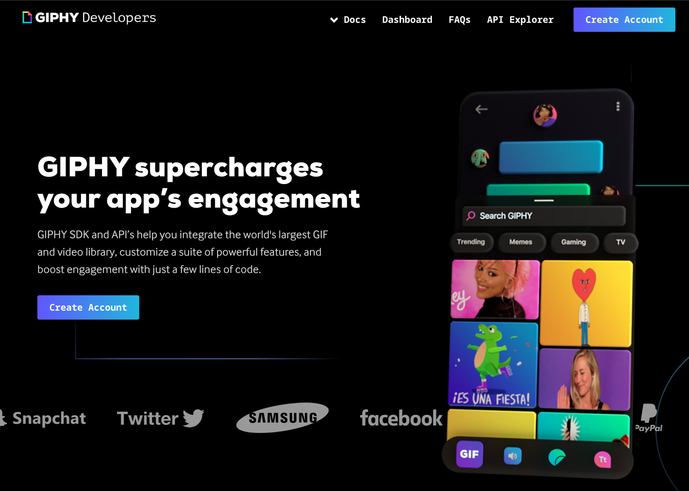
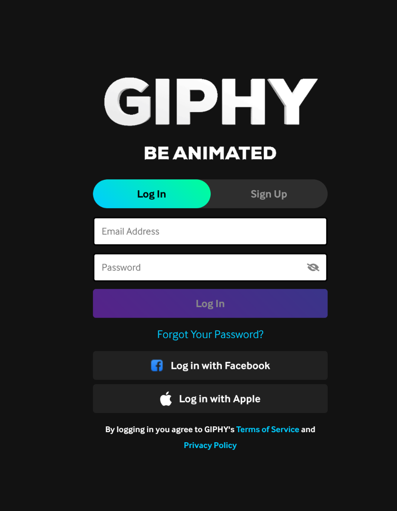
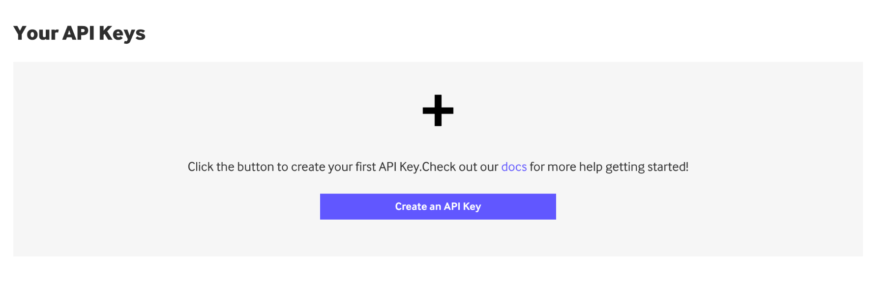
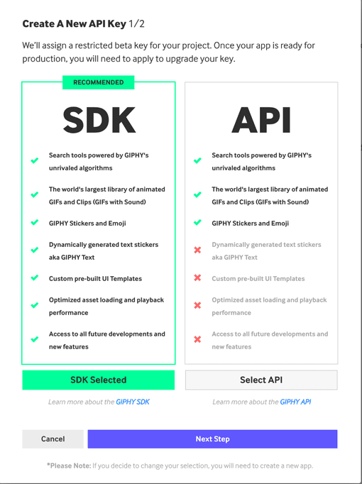
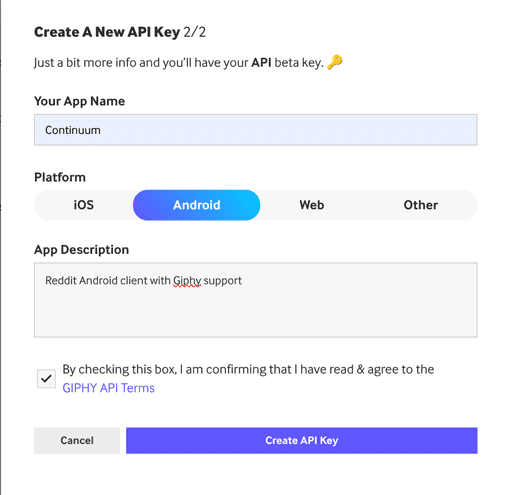

# Giphy API key creation
Continuum has to use a BYOK(Bring your own key) model. Continuum is open source, and [Giphy](https://giphy.com/)(now owned by [Shutterstock](https://www.shutterstock.com/)) charges crazy money for apps to use their API. This is very akin to [Reddit](https://www.reddit.com/) API costs, but much worse.

## Instructions
1. Go [here](https://developers.giphy.com/)
2. Click the `Create Account` button

3. Click `Sign Up` and create an account if needed, otherwise `Log In`

5. Click the `Create an API Key` button

6. Click `Select API` to pick `API` instead of `SDK`
7. Click the `Next Step` button

7. Set `Your App Name` to `Continuum`
8. Set `Platform` to `Android`
9. Set the `App Description` to `Reddit Android client with Giphy support`
10. Check the box for `By checking this box, I am confirming that I have read & agree to the GIPHY API Terms`
11. Click the `Create API Key` button

You should theen see a box like this on the page with your API key.

> [!NOTE]
>
> **kTWpBT9Zc5iZw8lZ0dTUcTukCwVHftSK** was a real API key, but has
> since been deleted. It won't work for you, so don't try it.
