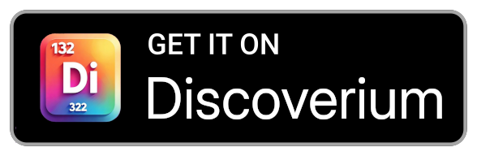

<h1 align="center">Continuum</h1>

  <picture>
    <source
      width="256px"
      media="(prefers-color-scheme: dark)"
      srcset="assets/logo/space_alien.png"
    >
    
  </picture>

  <a href="https://discord.gg/vDuSpJEDrW">
    <picture>
      <source height="24px" media="(prefers-color-scheme: dark)" srcset="/assets/icons/Discord.png" />
      
    </picture>
  </a>&nbsp;&nbsp;&nbsp;
  <a href="https://old.reddit.com/r/continuumreddit/">
    <picture>
      <source height="24px" media="(prefers-color-scheme: dark)" srcset="/assets/icons/Reddit.png" />
      
    </picture>
  </a>

A Reddit client on Android written in Java. It does not have any ads and it features a clean UI and smooth browsing experience

 

[Releases](https://github.com/cygnusx-1-org/continuum/releases)
[License](https://github.com/cygnusx-1-org/continuum/blob/master/LICENSE)
[GitHub issues](https://github.com/cygnusx-1-org/continuum/issues)

---
# Fork
This project is a fork of [Infinity for Reddit](https://github.com/Docile-Alligator/Infinity-For-Reddit).

One major enhancement is that it lets you set your own `Client ID` as a setting.
This means you don't need to recompile it each time, or to use [ReVanced Manager](https://github.com/ReVanced/revanced-manager).

# Setup
See [SETUP.md](/SETUP.md)

To log in with the webview-less method, paste the oauth URL you get from continuum into a *MOBILE* browser (only been tested on firefox on android so far), log in, allow access, and when reddit tries to redirect you, tap on the page *once*. This should leave you on the "redirecting to (url)" page. If unsuccessful, simply repeat until successful. Copy the redirect URL, and paste it in continuum.

# Installation
You can easily install and update Continuum with [Discoverium](https://github.com/cygnusx-1-org/Discoverium/) via its search button.

    <picture>
      <source media="(prefers-color-scheme: dark)" srcset="assets/badges/discoverium.png" height="60">
      
    </picture>
  </a>
  </a>&nbsp;&nbsp;&nbsp;
  <a href="https://github.com/cygnusx-1-org/continuum/releases/latest">
    <picture>
      <source media="(prefers-color-scheme: dark)" srcset="assets/badges/github.png" height="60">
      
    </picture>
  </a>

# About The Project
Unique features of **Continuum**:

- Ability to use your own `Client ID`.
- Ability to use your own Giphy gifs API key.
- Ability to backup your accounts.
- The max number of main page tabs has been increased to six.
- Sensible download names.
- Bug fixes and more...

Features from <b>Infinity</b>

* Lazy mode: Automatic scrolling of posts enables you to enjoy amazing posts without moving your thumb.
* Browsing posts
* View comments
* Expand and collapse comments section
* Vote posts and comments
* Save posts
* Write comments
* Edit comments and delete comments
* Submit posts (text, link, image and video)
* Edit posts (mark and unmark NSFW and spoiler and edit flair) and delete posts
* See all the subscribed subreddits and followed users
* View the messages
* Get notifications of unread messages
* etc...

(<a href="#top">back to top</a>)

# Contributing
First off, thanks for taking the time to contribute! Contributions are what makes the open source community such an amazing place to learn, inspire, and create. Any contributions you make are **greatly appreciated**.

If you have a suggestion that would make this better, please fork the repo and create a pull request.
It's better to also open an issue describing the issue you want to fix. But it is not required.

Don't forget to give the project a star! Thanks again!

1. Fork the Project
2. Create your Feature Branch from `master` (`git checkout -b feature/AmazingFeature`)
3. Commit your Changes (`git commit -m 'Add some AmazingFeature'`)
4. Push to the Branch (`git push origin feature/AmazingFeature`)
5. Open a Pull Request to the `master` Branch

Here are other ways you can help:

- [Report Bugs](https://github.com/cygnusx-1-org/continuum/issues/new?template=bug_report.md)

- [Request Features](https://github.com/cygnusx-1-org/continuum/issues/new?template=feature_request.md)

(<a href="#top">back to top</a>)

# Related project
[Slide](https://github.com/cygnusx-1-org/Slide) is another Android [Reddit](https://www.reddit.com/) client app. It is a fork of the original project. It is also in the [Google Play Store](https://play.google.com/store/apps/details?id=me.edgan.redditslide&hl=en_US).

# License
Distributed under the AGPL-3.0 License. See <a href="https://github.com/cygnusx-1-org/continuum/blob/master/LICENSE">LICENSE</a> for more information.

(<a href="#top">back to top</a>)

# Contact
[u/edgan](https://www.reddit.com/user/edgan) -
continuum@cygnusx-1.org (Owner)

Project Link: [https://github.com/cygnusx-1-org/continuum](https://github.com/cygnusx-1-org/continuum)

(<a href="#top">back to top</a>)

